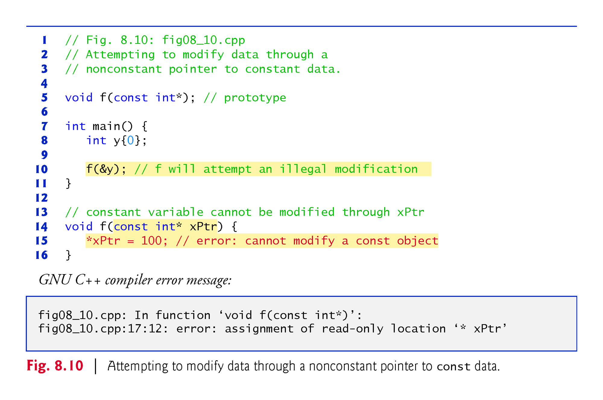
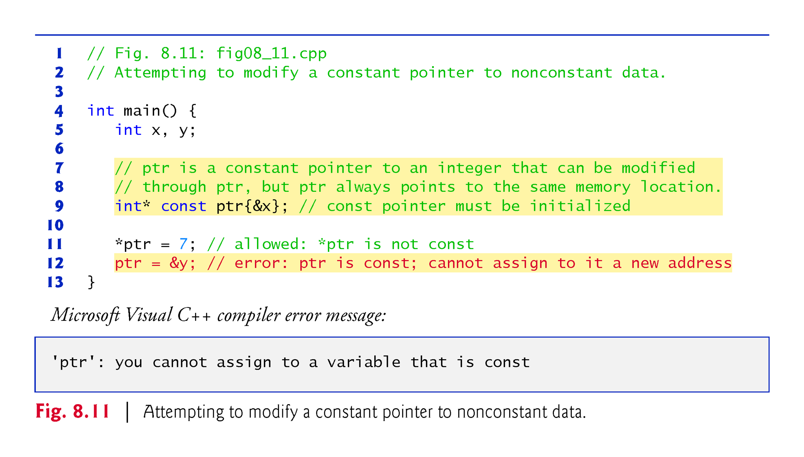
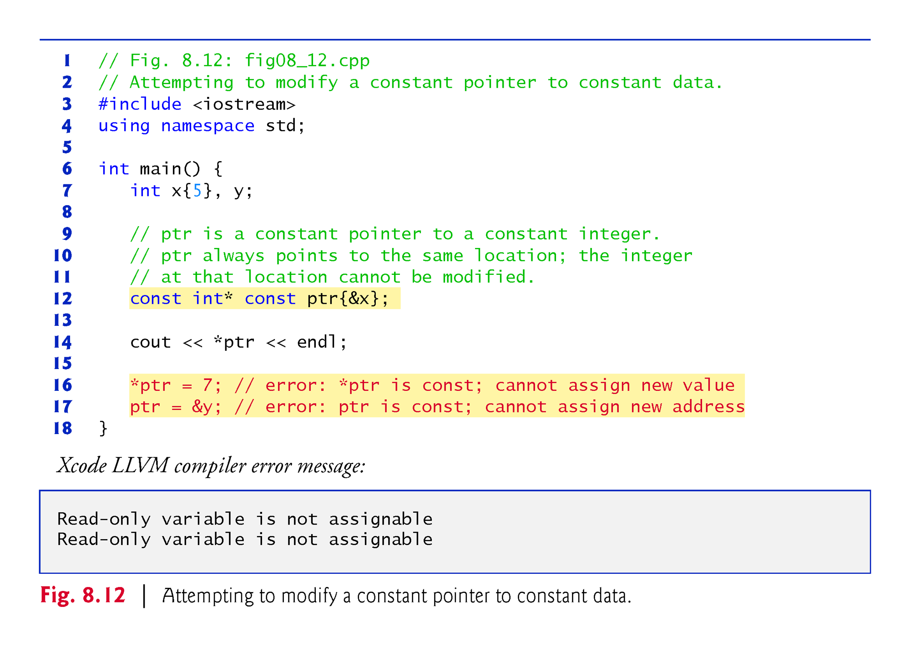
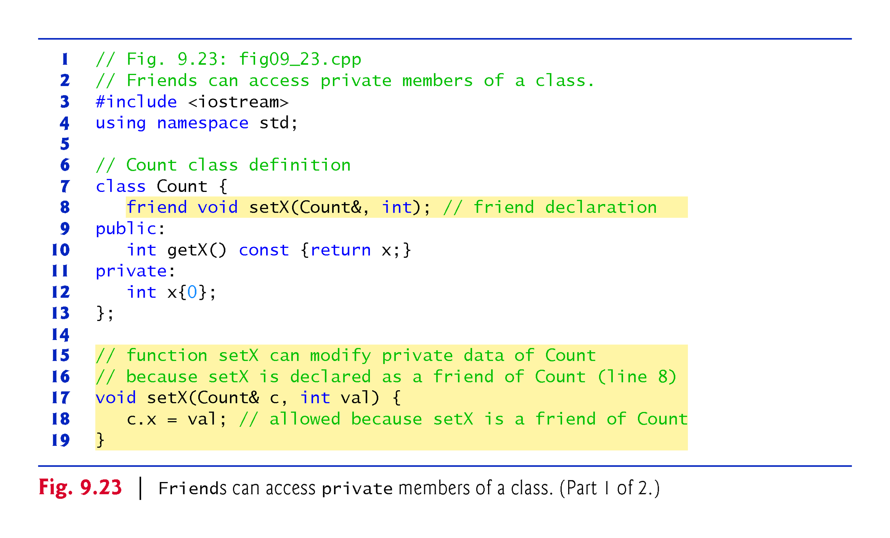
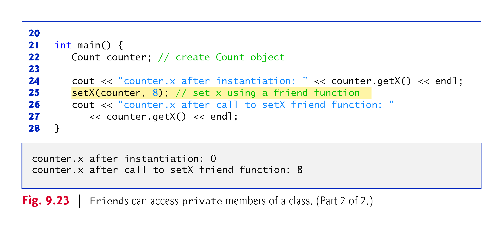
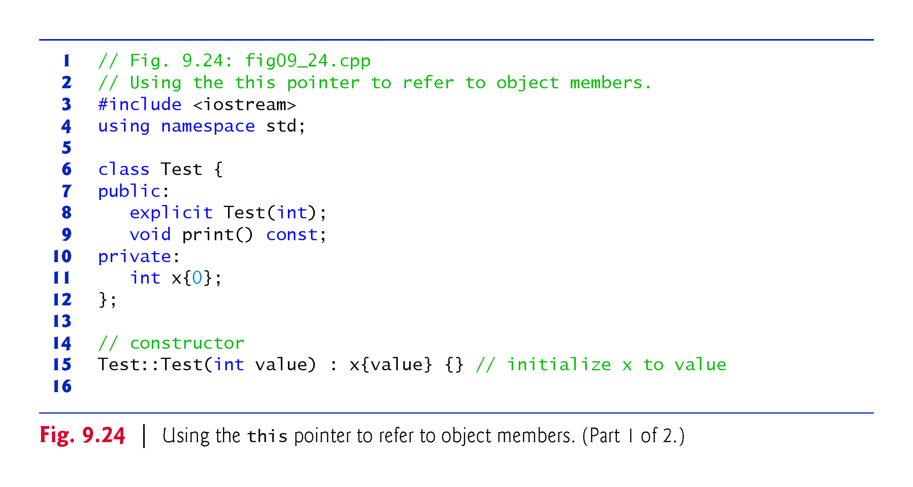
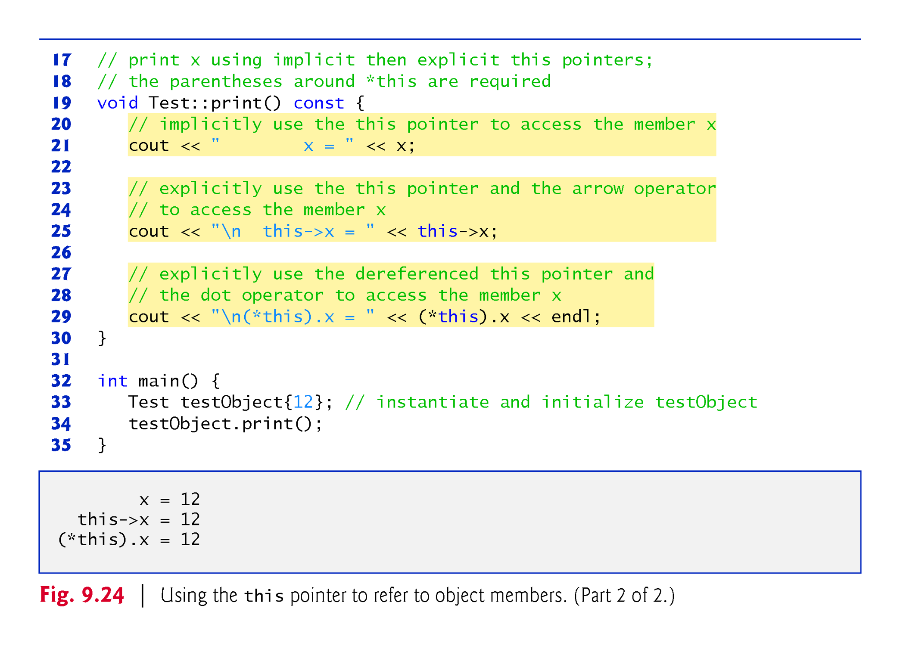
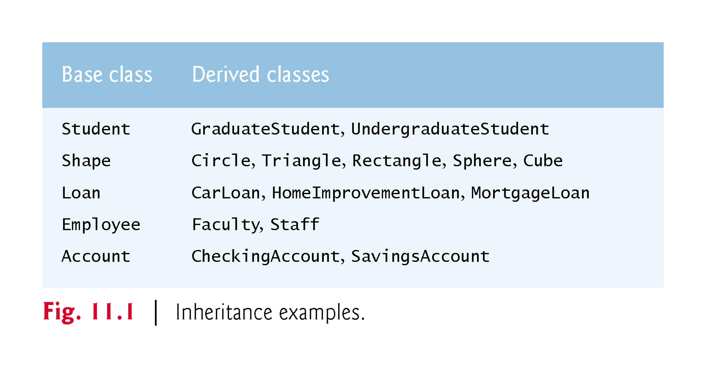
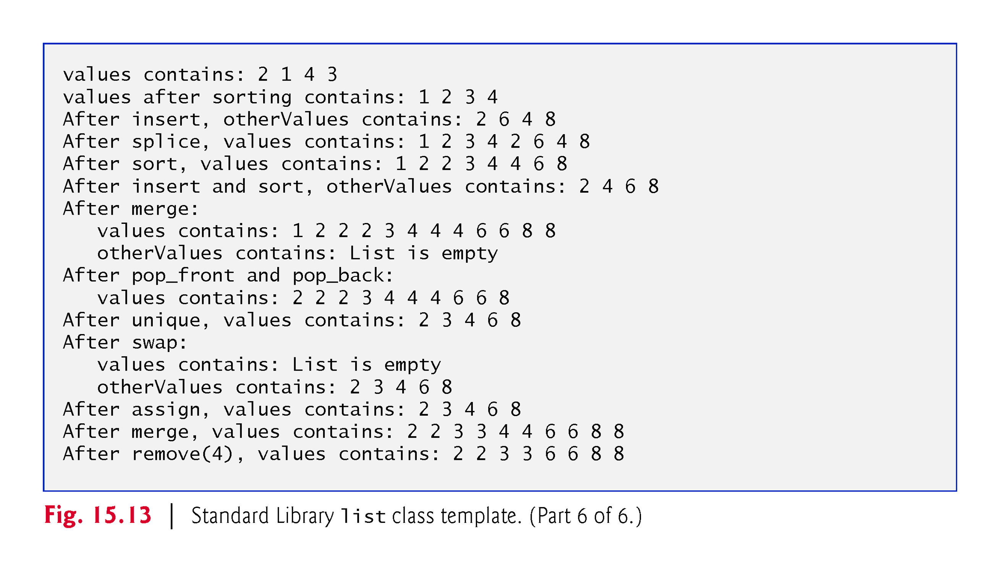

# CS 203

***Date**: 1/25/24*

When we code there are 3 places our code is stored:

**Code**

The instructions of the program

**Stack**

Where our function calls/temporary data is stored

**Heap**

The heap is where data is stored permanently. It's up to us to delete this data. 


```
in linux, some useful commands to navigate terminal:

pwd: (print working directory) shows current location 
ls: (list) shows what's in current folder
cd: (change directory) changes directory to a directory inside current location
    without argument, goes to home directory
    .. :goes back to parent directory

```

## Steps to coding in C++

Editing -> Preprocessing -> Compilation (Object code) -> Linking process -> Loading -> Execution


**Preprocessing** -> e.g. #includes which tells us what libraries we're going to be using

We will be combining preprocessing and compilation to 1 step and we'll be combining the last 3 to 1 step


## sample c++

```cpp
int main() {
    int x; // declaration
    int y,z; // declares y and z
    int t=42; // declaration and initialization
    string msg="Hello"; // declaration and initialization
    x=10;
    y=x+t; // 52
    z=y; // 52
    y=y*2; //104
    msg = msg + "; y="; // "Hello; y="
    cout << msg << y << "; z=" << z << endl; 
    return 0;
}
```


1 byte = 8 bits
int uses 4 bytes, so 32 bits

in 32 bits, the first is the **signed bit**, 

if it's **0(unsigned)**, the number will be **positive**, 

if **1(signed)**, the number will be **negative** 

since we only have 31 bits, the largest int we can hold is 2<sup>31</sup>

any type declaration/initialization that has **unsigned** will be positive no matter what. 


<hr>

***Date**: 1-29-24*

## Going over comparison operators

- different data types will not give a true boolean value despite having the same value 
    - e.g. 
    
    ```cpp
    float x = 0.1; 
    double y = 0.1; 
    cout << x == y  //would return false (0);
    ```

in order to see 'true' or 'false' we have to add the 'bool alpha' statement to the cout
    
e.g.
```cpp
cout << bool alpha << (a == b); // would show 'true' or 'false'
```

**Negation** has precedence over conjuntion and disjunction

- anything other than 0 in C++ is evaluated as true

**Conjunction** has precedence over disjunction


**&& and || are short circuit (aka lazy) operators.**

- When evaluating a&&b, if a is false, b is not evaluated
- when evaluating a||b, if a is true, b is not evaluated 

## The string type

- String is not primitice and requires the inclusino of the string library 
 ```cpp
 #include <string>
 ```

 Some escaped sequences include 
 
- \n newline
- \r returns the cursor to the front 


**cin** only records one line, to read the entire input we have to use **getline**

e.g. 
```cpp
#include <iostream>
#include <string>
using namespace std;

int main (){
    string s;

    cout << "Enter a string: ";
    // cin >> s; this would only record 1 word
    getline(cin, s);

    cout << s << endl; // would return the entire line inputted

    return 0;
}
```

- the 1st argument in getline is the istream object from which characters are extracted 
- the 2nd argument is where the input is stored

## Flow control

- if/else
- switch

e.g.
```cpp
switch (value to be checked){
    case value:
        instructions
        break;
    case value:
        instructions
        break;
    case value:
        instructions
        break;
    default: 
        instructions
        break;
}
```

### for loops

syntax: 
```cpp
for (initialization; test; action){
    loop content;
}
```
<br>
e.g. decrementing for loop

```cpp
int main(){
    for(int i = 100; i >= 1; i--){
        cout << i << endl;
    }
    return 0;
}
```

### while loops

syntax:
```cpp
while(condition){
    loop content;
}
```

e.g. while loop with input
```cpp
string user_input;
cout << "Hi, input line: ";
while (getline(cin, user_input)){ 
    // this will continue as long as user doesn't input the 'end input' command
    cout << "Tell me more...";
} // to exit this in linux, user can enter ctrl+D

cout << "thanks for ending it all!";
```

## Functions

syntax: 
```cpp
return_type function_name (type_of_arg1 name_of_arg1 type_of_arg2 name_of_arg2...){
    //code
}
```

e.g.
```cpp
float volumeCylinder (float radius, float height){
    return radius * radius * 3.14 * height;
}

int main(void){
    cout << volumeCylinder(4,6) << endl;
}
```

## the void type

- A type that isn't one
- the type of nothingness
- Sometimes also used to mean 'unknown'

<hr>

***Date:** 1/31/24*

## Arrays 

- An array is a contiguous group of memory locations that all have the same type.
- To refer to a particular location or element in the array, specify the name of the array and the position number of the particular element.
- The position number is more formally called a subscript or index (this number specifies the number of elements from the beginning of the array).
- The first element in every array has subscript 0 (zero) and is sometimes called the zeroth element.


```cpp
#include <iostream>
#include <array>

using namespace std;

int main(){
    array<int, 10> myintarray; // initialize an array of 10 int elements called myintarray

    // To display the elements in the array
    for (int i = 0; i < myintarray.size(); i++){ //size() function returns the initalized size of the array
        myintarray[i] = i+1; //stores the value of i in the corresponding index - 1
    }

    for (int element: myintarray){ // for every integer element in myintarray
        cout << element << " ";
    }

    cout << endl;

    return 0;
}
```

<hr>

***Date**: 2-1-24*

## Classes 

```cpp
// Account.h

#ifndef ACCOUNT_H //if this is not defined, we define it here, this prevents error of multiple includes of this file in other files
#define ACCOUNT_H 

#include <string>
#include <iostream>

class Account{
public:
    Account(){}

    explicit Account(std::string accountName):name(accountName){} //if only 1 argument we can put the word 'explicit' before the function name

    Account(std::string accountName, int initialBalance) 
        :name(accountName){

        if (initialBalance > 0){
            balance = initialBalance;
        }
    }

    void deposit(int depositAmount){
        if (depositAmount > 0){
            balance = balance + depositAmount;
        }
    }

    int getBalance() const{
        return balance;
    }

    void setName(std::string accountName){
        name = accountName;
    }

    std::string getName() const{ // const keyword after to ensure no data is being changed
        return name;
    }

    void withdraw(int withdrawAmount){
        if (withdrawAmount <= balance){
            balance = balance - withdrawAmount;
        } else{
            std::cout << "Withdrawal amount exceeded account balance";
        }
    }

private:
    std::string name; // default constructor called here 
    int balance{0};
};

#endif //ends the define
```

<hr>

***Date:** 02/05/24*

## Pointers

- Pointers also enable pass-by-reference and can be used to create and manipulate pointer-based dynamic data structures.

<br>

- A pointer contains the memory address of a variable that, in turn, contains a specific value.
- In this sense, a variable name directly references a value, and a pointer indirectly references a value.
- Referencing a value through a pointer is called indirection.
- Diagrams typically represent a pointer as an arrow from the variable that contains an address to the variable located at that address in memory

### Declaring Pointers

The declaration 
```cpp
int* countPtr, count;
int *countPtr;
```

declares the variable countPtr to be of type int* (i.e., a pointer to an int value) and is read (right to left), “countPtr is a pointer to int.”
Variable count in the preceding declaration is declared to be an int, not a pointer to an int.

The * in the declaration applies only to countPtr.
Each variable being declared as a pointer must be preceded by an asterisk (*).
When * appears in a declaration, it is not an operator—it indicates that the variable being declared is a pointer.

Pointers can be declared to point to objects of any type.

### Initilializing Pointers

- Pointers should be initialized to nullptr (new in C++11) or to a memory either when they’re declared or in an assignment. 
- A pointer with the value nullptr “points to nothing” and is known as a null pointer. 
- From this point forward, when we refer to a “null pointer” we mean a pointer with the value nullptr.

### Pointer Operators

The unary operators & and * are used to create pointer values and “dereference” pointers, respectively.


The address operator (&) is a unary operator that obtains the memory address of its operand.
Assuming the declarations
```cpp
int y{5}; // declare variable y
int* yPtr{nullptr}; // declare pointer variable yPtr
// the statement 
yPtr = &y; // assign address of y to yPtr
```
assigns the address of the variable y to pointer variable yPtr.


<br>

```cpp
int main (){
    int var1 = 45;

    int *intPtr = &var1; //& symbol denotes address of variable

    cout << "var1 is stored at location" << intPtr << endl; // address of var1
    cout << "var1 is stored at location" << &var1 << endl; // address of var1
    cout << "intPtr is stored at location" << &intPtr << endl; // address of intptr

    cout << "var1's value is " << *intPtr << endl; // dereferencing the pointer
    return 0;
}
```

### Pass-By-Reference with Pointers

There are three ways in C++ to pass arguments to a function
- **pass-by-value**
- **pass-by-reference with reference arguments**
- **pass-by-reference with pointer arguments.**

Here, we explain pass-by-reference with pointer arguments.

Pointers can be used to modify one or more variables in the caller or to pass pointers to large data objects to avoid the overhead of copying the objects.

**You can use pointers and the indirection operator (*) to accomplish pass-by-reference.**

When calling a function with an argument that should be modified, the address of the argument is passed.


```cpp
int square(int x){ // passed by value
    return x *= x;
}

void squareByRef(int &x){ // passed by reference 
    x *= x;
}

void squareByPointer(int *xPtr){ // passed by reference with pointer arg
    *xPter *= *xPter; // dereference
}
```

<br>

### Using const with Pointers

- Many possibilities exist for using (or not using) const with function parameters.

***Principle of least privilege***

- Always give a function enough access to the data in its parameters to accomplish its specified task, but no more.

There are **four** ways to pass a pointer to a function

- **a nonconstant pointer to nonconstant data**
    
    - The highest access is granted by a nonconstant pointer to nonconstant data
    - The data can be modified through the dereferenced pointer
    - The pointer can be modified to point to other data.
    - Such a pointer’s declaration (e.g., int* countPtr) does not include const. 

```cpp
int* countPtr
```
<br>

- **a nonconstant pointer to constant data**

    - A pointer that can be modified to point to any item of the appropriate type
    - The data to which it points cannot be modified through that pointer
    
        - Read from right to left as “countPtr is a pointer to an integer constant” or more precisely, “countPtr is a non-constant pointer to an integer constant.” 
```cpp
 const int* countPtr;
```


<br>


- **a constant pointer to nonconstant data** 

    - always points to the same memory location
    - the data at that location can be modified through the pointer
    - Pointers that are declared const must be initialized when they’re declared.
    - If the pointer is a function parameter, it’s initialized with a pointer that’s passed to the function.

```cpp
int* const ptr{&x};
```



<br>


- **a constant pointer to constant data** 

    - The minimum access privilege is granted by a constant pointer to constant data.
    - Such a pointer always points to the same memory location
    - The data at that location cannot be modified via the pointer.
    - This is how a built-in array should be passed to a function that only reads from the built-in array, using array subscript notation, and does not modify the built-in array.
        - Read from right to left as “ptr is a constant pointer to an integer constant.” 
```cpp
const int*  const
```



<br>


Each combination provides a different level of access privilege.

<hr>

***Date:** 2/7/24*

## Classes: A deeper look

### Introduction

- Using an *include guard* in a header to prevent header code from being included in the same source code file more than once. 
- Using an ostringstream to create string representations of objects.
- An overview of the compile/link process.
- Accessing object members via the object’s name, a reference to an object and a pointer to an object.
- Access functions that can read or write an object’s data members.
- Utility functions—private member functions that support the operation of the class’s public member functions.
- How default arguments can be used in constructors.
- Destructors that perform “termination housekeeping” on objects before they’re destroyed.
- The *order* in which constructors and destructors are called.
- How returning a reference or pointer to private data *breaks the encapsulation* of a class, allowing client code to directly access an object’s data.
- Default memberwise assignment to assign an object of a class to another object of the same class.
- const objects and const member functions to prevent modifications of objects and enforce the principle of least privilege. 
- **Composition**—a form of reuse in which a class can have objects of other classes as members. 
- **Friendship** to specify that a nonmember function can also access a class’s non-public members—a technique that’s often used in operator overloading for performance reasons. 
- ``this`` pointer, which is an implicit argument in all calls to a class’s non-static member functions, allowing them to access the correct object’s data members and non-static member functions. 

### ``Time`` Class Case Study

We're going to have **3** files:

- Account.h
- Time.h
    
    - Will contain:
    - datamembers
    - member function prototypes (functions without a body) 
- Time.cpp

    - member function implementations
    - source code hidden from the client 


Time.h
```cpp
// Time.h
// Time Class Definition
// Member functions are defined in Time.cpp
#include <string>

// prevent multiple inclusions of header
#ifndef TIME_H
#define TIME_H

//Time class definition
class Time {
    public: 
        Time(int =0, int = 0, int = 0); // if no value is provided, these will be initialized to zero
        void setTime(int, int, int); // set hour, minute and second
        void setHour(int);
        void setMinute(int);
        void setSecond(int);
        unsigned int getHour() const;
        unsigned int getMinute() const;
        unsigned int getSecond() const;
        std::string toUniversalString() const;
        std::string toStandardString() const;
    private:
        unsigned int hour{0}; // 0 - 23 (24-hour clock format)
        unsigned int minute{0}; // 0 - 59
        unsigned int second{0}; // 0 - 59
};

#endif
```


Time.cpp
```cpp
// Time.cpp
// Time class member-function definitions
#include <iomanip> // for setw and setfill stream manipulators
#include <stdexcept> // for invalid_argument exception class
#include <sstream> // for ostringstream class
#include <string>
#include "Time.h" // include definition of class Time from Time.h

using namespace std;

Time::Time(int h, int m, int s)
{
    setHour(h);
    setMinute(m);
    setSecond(s);
}

void Time::setTime(int h, int m, int s){
    // valudate hour, minute and second
    if ((h >= 0 && h < 24) && (m >= 00 && m < 60) && (s >= 0 && s < 60)){
        hour = h;
        minute = m;
        second = s;
    } else {
        throw invalid_argument(
            "hour, minute, and/or second was out of range");
    }
}


//setter functions

void Time::setHour(unsigned int h){
    if (h >= 0 and h< 24){
        hour = h;
    }
    else {
        throw std::invalid_argument("Hour must be between 0 and 23");   
    }
}

void Time::setMinute(unsigned int m){
    if (m >= 0 and m< 60){
        minute = m;
    }
    else {
        throw std::invalid_argument("Minute must be between 0 and 60");   
    }
}

void Time::setSecond(unsigned int s){
    if (s >= 0 and s< 60){
        second = s;
    }
    else {
        throw std::invalid_argument("Second must be between 0 and 60");   
    }
}

// getter functions

unsigned int Time::getHour(){ return hour;}

unsigned int Time::getMinute(){ return minute;}

unsigned int Time::getSecond(){return second;}

// return Time as a string in universal-time format (HH:MM:SS)
string Time::toUniversalString() const{
    ostringstream output;
    output << setfill('0') << setw(2) << hour << ":" << setw(2) << minute << ":" << setw(2) << second;
    return output.str(); // returns the formatted string
}

// return Time as string in standard-time format (HH:MM:SS AM or PM)
string Time::toStandardString() const{
    ostringstream output; 
    output << ((hour == 0 || hour == 12) ? 12: hour % 12 ) << ":" << setfill('0') << setw(2) << minute << ":" << setw(2) << second << (hour < 12 ? " AM" : " PM");
    return output.str(); // returns the formatted string
}
```

NOTE: **setfill** is a **sticky function** and will affect the rest of the stream, **setw** is **not** and has to be called before every string


main.cpp
```cpp
// File to test Time class
// NOTE: this file must be compiled with Time.cpp
#include <iostream>
#include <stdexcept> // invalid_argument exception class
#include "Time.h" // definition of class Time

using namespace std;

// displays a Time in 24-hour and 12-hour formats
void displayTime(const string& message, const Time& time){
    cout << message << "\nUniversal time: " << time.toUniveralString() << "\nStandard Time: " << time.toStandardString() << "\n\n";
}

int main(){
    Time t(23,45,12); //instantiate object t of class Time
    Time t2(2,10); //instantiate object t of class Time
    Time t3(4); //instantiate object t of class Time
    Time t4(); //instantiate object t of class Time

    // we can use references/ptrs 
    Time & timeRef = t2;
    Time *timePtr = t;

    //if we want to use the pointer, we have to use the arrow notation
    timePtr->setTime(12,27,6);

    //we don't have to do this with references
    timeref.setTime(12,27,6)

    displayTime("Initial time:", t); //displays t's intial value

    t.setTime(13,27, 6); // change time
    displayTime("After setTime: ", t); // displays t's new value

    //attempt to set the time with invalid values
    try {
        t.setTime(99,99,99);
    } 
    catch (invalid_argument& e){
        cout << "Exception:" << e.what() << "\n\n";
    }

    //display t's value after attempting to set an invalid time
    displayTime("After attempting to set an invalid time:", t);
}
```

<h1 style="color:red;"> !!! important note !!!</h1>

```
In Microsoft Visual Studio, add to your project all the headers and source-code files that make up a program, then build and run the project

For GNU C++, open a shell and change to the directory containing all the files for a given program, then execute the following command:

g++ -std=c++14 *.cpp -o ExecutableName

*.cpp specifies to compile and link all of the source-code files in the current directory—the preprocessor automatically locates the headers in that directory.

Could also manually compile each file with 

g++ -c file filen_name.h filename_2.cpp // just the .h and main files, not member function definitions file

can make an executable with the generated operational files with

g++ -o output_name file_name.o file_name2.o

which will output an executable with default name a.out, or output_name
```

<hr>

***Date:** 2/8/24*

### Working with Date Class

Date.h (header)
```cpp
// Date.h
// Date class declaration. Member functions are defined in Date.cpp
#include string

// prevent multiple inclusions of header
#ifndef DATE_H
#define DATE_H

// class Date definition
class Date{
    public:
        explicit Date(unsigned int = 1, unsigned int = 1, unsigned int = 2000);
        std::string toString const();
    private:
        unsigned int month;
        unsigned int day;
        unsigned int year;
};

#endif
```

Date.cpp
```cpp
// Date.cpp
// Date class member function definitions
#include <sstream>
#include <string>
#include "Date.h" //include class definition Date
using namespace std;

// Date constructor (should do range checking)
Date::Date(unsigned int m, unsigned int d, unsigned int y):month{m}, day{d}, year{y} {}

// print date in format mm/dd/yyyy
string Date::toString() const {
    ostringstream output;
    output << month << "/" << day << "/" << year;
    return output.str();
}
```

### Destructors

~ denotes a destructor

e.g.

```cpp
//Time.h
// in public
~Time();
```

if you define a destructor, it must be used in the member function declarations

```cpp
//Time.cpp
Time::~Time(){
    std::cout << "Destructor is being called for " << toUniversalString() << std::endl;
}
```

When the main function returns, the destructors are called 1 by 1, it works like a stack, so the last object you create gets destroyed first

***Date**: 2/14/24💗*

## Composition: Objects as Members of Classes

In header files, we can assign variables in the public section

Function definitions in the private file can only be used in the functions defined in the public section


<h1 style="color:red;"> !!! important note !!!</h1>

To compile specific files, use 

```
g++ -c filename
```
to get the .o files, can use it multiple times, then use 

```
g++ -o <name of executable> file1.o file 2.o
```

and then run the executable with 

```
./<name of executable>
```
<hr>


***Date:** 2/15/24*

## Company class exercise

working with Company.h, Company.cpp, main.cpp

<hr>

***Date:**2/21/24*

## Friend functions and friend classes

- A friend function of a class is a non-member function that has the right to access the public and non-public class members. 
- Standalone functions, entire classes or member functions of other classes may be declared to be friends of another class. 

### Declaring a friend
- To declare a non-member function as a friend of a class, place the function prototype in the class definition and precede it with keyword friend. 
- To declare all member functions of class ClassTwo as friends of class ClassOne, place a declaration of the form
```friend class ClassTwo;```
in the definition of class ClassOne.
- The friend declaration(s) can appear anywhere in a class and are not affected by access specifiers public or private (or protected, which we discuss in Chapter 11).

We can call friend functions without initializing an instance of the class

Accessing a data memmber this way is more efficient 






## Using the ```this``` keyword

- Every object has access to its own address through a pointer called ```this``` (a C++ keyword). 
- The ```this``` pointer is not part of the object itself—i.e., the memory occupied by the this pointer is not reflected in the result of a sizeof operation on the object. 
- Rather, the this pointer is passed (by the compiler) as an implicit argument to each of the object’s non-static member functions. 






## Add Cascading functions notes here!!!!

**Static and friend functions don't need an instance of the class to be called**

<hr>

## Operator Overloading

string class has a lot of method functions, 

substr for example can take in different arguments

e.g.

```cpp
string s1 = "happy";
```

```substr(starting index)```

```substr(starting index, number of characters)```

```[]``` is also overloaded for the string class

```+=``` is an example of an overloaded operator, for the string class, it concatenates the strings together. 

when we do somehting like 


```cpp
cout << s1 << s2;
```

```cout``` is an **ostream object**, and the ```<<``` is a function that takes in 2 arguments, the ```cout``` being one of them. 


<hr>

Date: 2/29/24

## Inheritance

### Introduction 

- Inheritance 
    - A form of software reuse in which you create a class that absorbs an existing class’s data and behaviors and enhances them with new capabilities.
- You can designate that a new class should inherit the members of an existing class.
- This existing class is called the base class, and the new class is referred to as the derived class.
- A derived class represents a more specialized group of objects.
- C++ offers public, protected and private inheritance.
- With public inheritance, every object of a derived class is also an object of that derived class’s base class.
- However, base-class objects are not objects of their derived classes.
- With object-oriented programming, you focus on the commonalities among objects in the system rather than on the special cases.
- We distinguish between the is-a relationship and the has-a relationship.
- The *is-a* relationship represents inheritance.
- In an *is-a* relationship, an object of a derived class also can be treated as an object of its base class.
- By contrast, the *has-a* relationship represents composition.
- Because every derived-class object is an object of its base class, and one base class can have many derived classes, the set of objects represented by a base class typically is larger than the set of objects represented by any of its derived classes.
- Inheritance relationships form class hierarchies.
- A base class exists in a hierarchical relationship with its derived classes.
- Although classes can exist independently, once they’re employed in inheritance relationships, they become affiliated with other classes.
- A class becomes either a base class—supplying members to other classes, a derived class—inheriting its members from other classes, or both.
 



<hr>

Overloading -> Same function, different parameters,

Overriding -> Same signature, implementation different/ derived function overrides the base class function. 


<hr>

Abstract classes are classes that are never meant to be instantiated into an object, they are base classes that are completed by the classes that inherit it. 

- A class is made abstract by declaring one or more of its virtual functions to be “pure.” A pure virtual function is specified by placing “= 0” in its declaration, as in


```cpp
virtual void draw() const = 0; // pure virtual function
```


- The “= 0” is a pure specifier.
- Pure virtual functions typically do not provide implementations, though they can.
- you can NOT instantiate an object of an abstract class


<hr>

## Iterator methods

### iterator_name.method()

## Vector methods

- ```push_back(element)```: 
- ```cbegin()```: returns iterator to the first element
- ```cend()```:  returns iterator of the next to last element
- ```crbegin()```: returns reverse iterator to the last element
- ```crend()```: returns reverse iterator to the first element 
- ```insert(iterator_position, element)```
- ```insert(iterator, beginning_iterator, ending_iterator)```
- ```erase(iterator)```: erases element at iterator 
- ```erase(iterator begin, iterator end)```

### not a member function

- ```copy(begin iterator, ending iterator, output stream iterator)```

<hr>

## Lists

- bidirectional 
- can only access elements through iterators


### C++ forward_list

- Singly linked list

### list methods

- ```push_front(element)```: pushes element to front of list
- ```pop_front()```: returns element at the front of list, removes that element 
- ```push_back()```: pushes element to the end of the list
- ```pop_back()```: returns last element, removes that element from the list
- ```sort()```: sorts integers/double values of a integer/double list from lowest -> greatest
- ```insert(iterator_position, element)```
- ```insert(iterator, beginning_iterator, ending_iterator)```
- ```values.splice(iterator, other_values)```: removes other_values elements and inserts at given iterator address
- ```merge(list_2)```: removes elements from list_2 and inserts into list that called the function in sorted order 
- ```unique()```: removes duplicate elements
- ```values.swap(other_list)```: swaps elements of values and other_list
- ```values.assign(other_values.cbegin(), other_values.cend())```: replace contents of values list with contents of other_values list through iterators
- ```values.remove(value)```: removes all instances of value in values list



<hr>

## Deques

- "double-ended queue" 
- Class deque is also implemented for efficient insertion and deletion operations at its front and back, much like a list (although a list is also capable of efficient insertions and deletions in the middle of the list).
- Class deque provides support for random-access iterators, so deques can be used with all Standard Library algorithms.


<hr>

## Function/Class Templates

- All function template definitions begin with the template keyword followed by a template parameter list enclosed in angle brackets (< and >).
- Every parameter in the template parameter list is preceded by keyword typename or keyword class.
- The type parameters are placeholders for fundamental types or user-defined types.
Used to specify the types of the function’s parameters, to specify the function’s return type and to declare variables within the body of the function definition.

e.g.
```cpp
template <typename T>
T maximum(T value1, T value2, T value3){ // returns type T
    T maxValue = value1;
    // code to compare values
    return maxValue;
}
```

implementations must be in the ***header file***

- we can use composition (stack **has a** deque) to implement template classes or
- we can use **private inheritance** so only the class has access to the functions we need from the class we're inheriting (stack privately inherits from deque class)